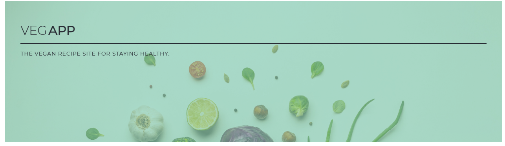
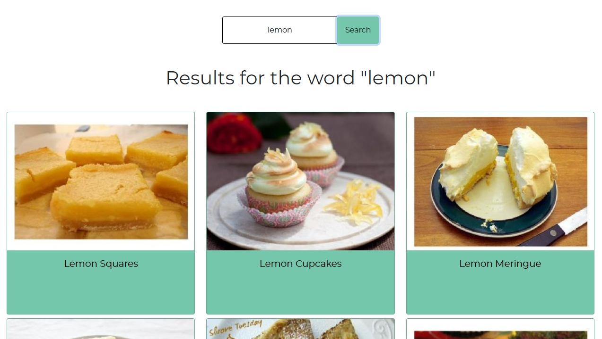
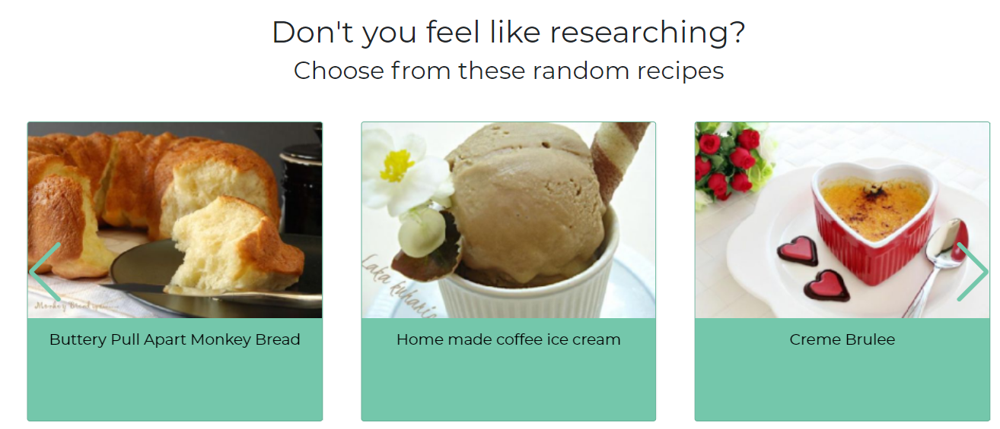
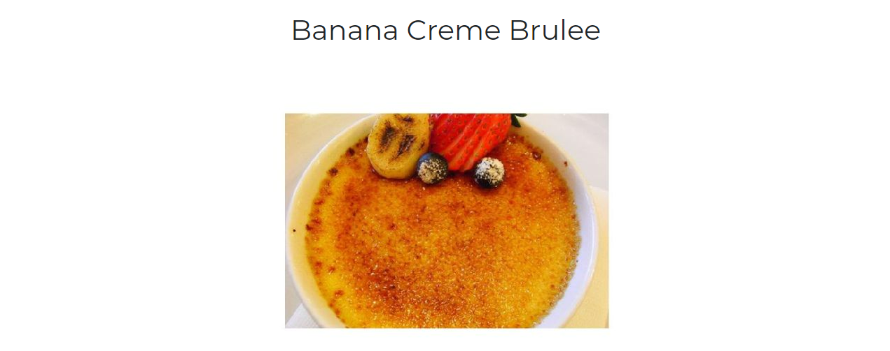
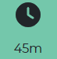
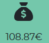
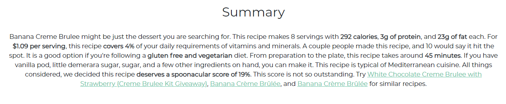
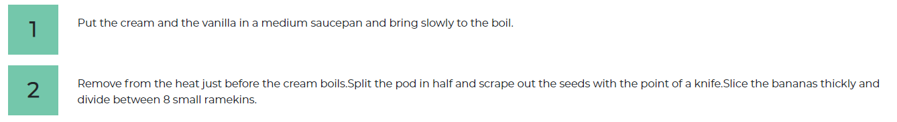

# VEGAPP

## ABOUT THE PROJECT
The purpose of the application is to promote healthy eating.

(<a href="#top">back to top</a>)

## DESCRIPTION

By entering the main ingredient in the search bar, a list of vegan recipes will be displayed.

(<a href="#top">back to top</a>)

## HOW TO USE THE APPLICATION

The application will work by displaying 3 pages:
1) Home;
2) Detail;
3) Error.

### HOME:

The Home page, is the main page of the App.

The Home page is divided as follows:

#### IMAGE WITH TEXT:

Used for the purpose of being able to display the name of the app and also used as a filler section for the page;

#### SEARCHBAR:

Through the searchbar it will be possible to perform searches;

#### RESULTS:

The section that will allow us to display the results of our searches;

#### RANDOM RECIPES:

Where 10 random recipes will be displayed even without using the searchbar;

(<a href="#top">back to top</a>)

### DETAIL:

Once clicked in one of the results obtained from our search, the user will be redirected to the Detail page where more information can be viewed.

The Detail page is composed as follows:

#### TITLE AND IMAGE:

This section will display the title of the search and an image of the recipe when completed.

#### ICON LIST:

Additional information about the recipe will be displayed through this section:\
\
**time**: The minutes for making the dish;\
\
**portions**: how many people it will be possible to serve the dish to;\
\
**price**: the value to be given to the dish( according to Spoonacular);\
\
**healthscore**: the rating of authenticity( according to Spoonacular).

#### SUMMARY:

In this section you will be able to view a brief introduction of your chosen recipe.

#### INGREDIENTS LIST:

In this section you will be able to view the list of ingredients for making the recipe.

#### STEPS:

This section will display all the necessary steps for making the recipe.

(<a href="#top">back to top</a>)

### ERROR:

The user will be redirected to this page if there are any errors in the application.

(<a href="#top">back to top</a>)

## APPLICATION DEPENDENCIES

#### AXIOS:

Axios is a Javascript library used to make HTTP requests from XMLHttpRequests from the browser and it supports the Promise API. It can be used intercept HTTP requests and responses and enables client-side protection against XSRF.

##### SWIPER:

Swiper is the most modern free mobile touch slider with hardware accelerated transitions and amazing native behavior. It is intended to be used in mobile websites, mobile web apps, and mobile native/hybrid apps.

(<a href="#top">back to top</a>)

## TEST THE APPLICATION

Want to try the application? You can try the app on [Netlify](https://vegapp.netlify.app/)

(<a href="#top">back to top</a>)

## CONTACTS

Email: [gennuso.biagio@gmail.com](mailto:gennuso.biagio@gmail.com)

Github: [Vegapp](https://github.com/bilabixxx/Vegapp)

(<a href="#top">back to top</a>)
